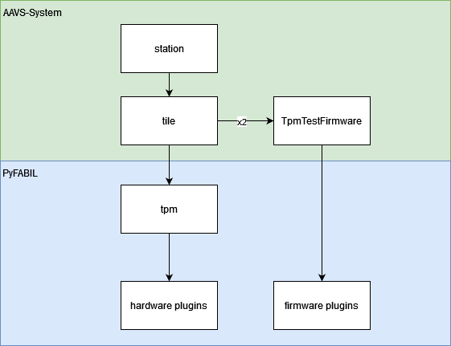
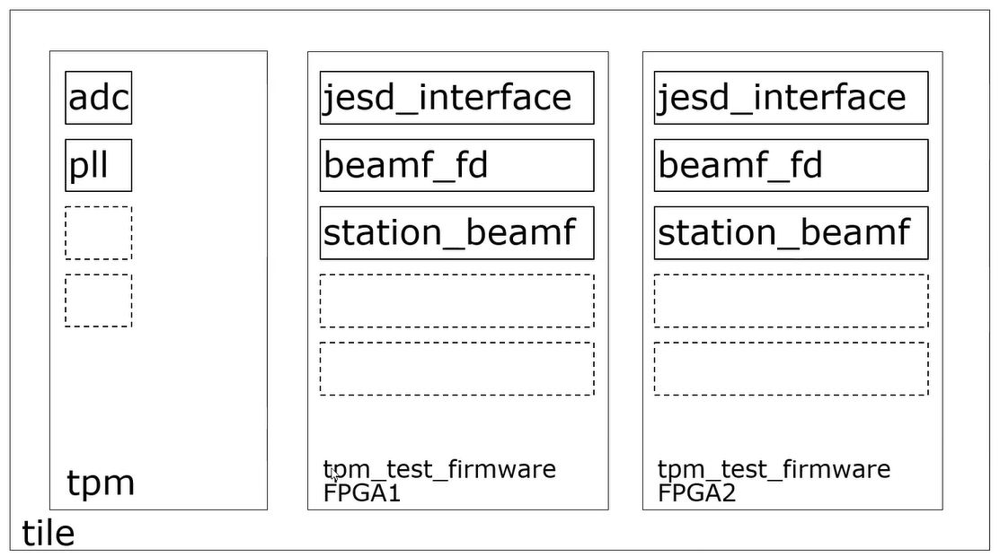

Overview
===================================

AAVS-System is a python package which is a monitors, controls and tests the TPM hardware.
This is achieved by using the python package PyFABIL to communicate with the TPM.

AAVS System Software was originally created to the enable control of the AAVS1 (Aperture Array Verification System 1) and subsequently AAVS2. 
The aim was to demonstrate and to de-risk the development of the signal processing chain.

MCCS will be used to monitor and control AAVS3 (Aperture Array Verification System 3) and the SKA-Low telescope of SKA1.
AAVS System Software is a dependency used by MCCS to allow monitoring and control of Tile Processing Modules.

Structure
----------

The top level class of AAVS system is station class. The hierarchy of AAVS system is as follows:

    * Station object: represents a set of synchronised tiles (TPMs)

        * Tile object: controls a tile, controls interaction between board plugins and FPGA firmware plugin

            * Tpm object: load hardware plugins and define interaction between them

                * Hardware plugins: control a specific piece of hardware, e.g. PLL, ADC, etc ...

            * tpm_test_firmware plugin: methods related to a single FPGA firmware, load firmware plugins, controls interaction between them (in AAVS)
            
                * Firmware plugins: control a specific firmware module, e.g. JESD ADC interface, tile beamformer, station beamformer, etc ...

The following diagrams shows the structure of AAVS system:

Setup
-----------

AAVS system software is installed to /opt/aavs 

This can only be done by a user with sudo privileges.

First clone AAVS-System into your local area

.. code-block:: console

    git clone git@gitlab.com:ska-telescope/aavs-system.git
    cd aavs-system
    git checkout master
    git pull

Install AAVS software onto your machine by running the deploy script

.. code-block:: console

    ./deploy.sh

This script should not be executed with sudo, however the user executing it must have sudo privileges. Only the user running this script will have privileges to install additional python packages in the virtual environment.
This script uses /usr/bin/python3 as default Python interpreter. To use another interpreter, for instance python 3.8, instead of the default python3, run the following before deploying.

.. code-block:: console

    AAVS_PYTHON_BIN=/usr/bin/python3.8
    export AAVS_PYTHON_BIN

After running the deploy script the Python virtual environment can be sourced as below:

.. code-block:: console

    source /opt/aavs/python/bin/activate

Using the command line option -c will delete the following directories before installing aavs-system.

.. code-block:: console

    /opt/aavs/python
    /src/build
    python/build
    python/dist
    third_party

If developing AAVS System software, PyFABIL and iTPM Bios branches can be specified with the -b and -t arguments, both of which default to master. For example:

.. code-block:: console

    cd aavs-system
    git fetch
    git switch feature-branch-aavs
    git pull
    ./deploy.sh -b feature-branch-pyfabil -c

Using AAVS System 
------------------

Once AAVS System software has been installed a station can be deployed.

This requires a station config file corresponding to the used system. 
Existing config files are shown in the table at the end of this page. 
If a new configuration file is needed refer to config/default_config.yml. 
It is suggested to copy, rename and modify the default configuration according to the used system.

Even if using an existing config file, the IP addresses of the TPMs may need to be changed as well as the number of TPMs to be used.

If developing FPGA firmware, the bitfile to be used can also be altered in the station config file.

The station can then be deployed with ipython as below:

The arguments IPB initialise, program the FPGAs and start the beamformers. The full set of command line arguments are available below but this is the most common usage when deploying a station with ipython.

.. code-block:: console

    pushd python/pyaavs/
    ipython -i station.py -- --config=config.yml -IPB

Once the station is initialised you will find yourself in an ipython shell.
At this stage some useful functionality is as follows:

Accessing the TPMs in a station and some basic examples of reading attributes:

.. code-block:: console

    In [1]: tile = station.tiles[0]
    In [2]: tile.get_temperature()
    Out[2]: 58.8125
    In [3]: tile.get_voltage(voltage_name='FPGA0_CORE')
    Out[3]: {'FPGA0_CORE': 0.94}

Getting the health status dictionary for a tile:

.. code-block:: console

    In [4]: health_dict = tile.get_health_status()

Although methods such as the above exist to access TPM attributes, TPM registers can be accessed directly.
During development you may want to call a plugin method directly from ipython , for example the tpm_test_firmware plugin:

.. code-block:: console

    In [1]: tile = station.tiles[0]
    In [2]: fpga0_firmware = tile.tpm.tpm_test_firmware[0]
    In [3]: fpga1_firmware = tile.tpm.tpm_test_firmware[1]
    In [4]: fpga0_firmware.check_ddr_initialisation()
    Out[4]: True
    In [5]: fpga1_firmware.check_ddr_initialisation()
    Out[5]: False

.. note::
    Only access plugin methods directly if you know what you are doing. This is only intended for development purposes, 
    most plugin methods should have a corresponding method exposed in AAVS tile.

AAVS System Hardware tests
--------------------------

To test the hardware and firmware these are many test available in AAVS System.
These tests allow easier testing of new hardware or fimware updates.

To run the hardware tests first of all setup AAVS system, see `Setup`_ for more details.

Navigate to tests directory:

.. code-block:: console

    pushd python/pyaavs/tests/

Execute the test wrapper with a specified station configuration file and test configuration file:

.. code-block:: console

    python  test_wrapper.py --config=config.yml --test_config=test_config.yml

Adding a -i at the end will run the tests in interactive mode, so you can select which tests to run.

To create new tests, Classes created in the /tests directory beginning with test\_ are automatically imported by the test_wrapper script.

Here is a list of available hardware tests:

+-------------------+------------------------------------------------------------------------------------------------------------------------------------------------------------------------------+
| Test name         | description                                                                                                                                                                  |
+===================+==============================================================================================================================================================================+
| init_station      | Program, initialise station and start station beamformer. Check if station beam data rate is within expected range.                                                          |
+-------------------+------------------------------------------------------------------------------------------------------------------------------------------------------------------------------+
| preadu            | Check operation of the preADU. This test will only run if preADU is detected. WARNING: this test will overwrite the gains in the preADU, and the non eep non volatile memory |
+-------------------+------------------------------------------------------------------------------------------------------------------------------------------------------------------------------+
| antenna_buffer    | Check operation of the antenna buffer in DDR using incremental pattern.                                                                                                      |
+-------------------+------------------------------------------------------------------------------------------------------------------------------------------------------------------------------+
| station_beam      | Check operation of networked beamformer using synthetic data pattern.                                                                                                        |
+-------------------+------------------------------------------------------------------------------------------------------------------------------------------------------------------------------+
| full_station      | Check operation of networked beamformer comparing offline and realtime beam power.                                                                                           |
+-------------------+------------------------------------------------------------------------------------------------------------------------------------------------------------------------------+
| ddr               | Check on-board DDR using FPGA embedded test.                                                                                                                                 |
+-------------------+------------------------------------------------------------------------------------------------------------------------------------------------------------------------------+
| adc               | Check JESD link setting test patterns in the ADCs and verifying data received by FPGAs                                                                                       |
+-------------------+------------------------------------------------------------------------------------------------------------------------------------------------------------------------------+
| tile_beamformer   | Check if the beamformer corrects for time domain delays applied to the internally generated tone.                                                                            |
+-------------------+------------------------------------------------------------------------------------------------------------------------------------------------------------------------------+
| flagging          | Check if oveflown data are correctly flagged by tile beamformer.                                                                                                             |
+-------------------+------------------------------------------------------------------------------------------------------------------------------------------------------------------------------+
| f2f               | Check fast data link between FPGAs using FPGA embedded test.                                                                                                                 |
+-------------------+------------------------------------------------------------------------------------------------------------------------------------------------------------------------------+
| daq               | Check data transfer from FPGAs to LMC using DAQ software. All data format checked: raw, channel, tile beam and integrated data.                                              |
+-------------------+------------------------------------------------------------------------------------------------------------------------------------------------------------------------------+
| health_monitoring | Check correct reading and clearing of TPM health monitoring points.                                                                                                          |
+-------------------+------------------------------------------------------------------------------------------------------------------------------------------------------------------------------+
| c2c               | Check communication bus between CPLD and FPGAs. WARNING: this test will overwrite the XML memory map in the FPGAs. Initialise station needed after execution.                |
+-------------------+------------------------------------------------------------------------------------------------------------------------------------------------------------------------------+
| channelizer       | Check channelizer output using the FPGA internal tone generator.                                                                                                             |
+-------------------+------------------------------------------------------------------------------------------------------------------------------------------------------------------------------+
| pfd               | Check channelizer output using the FPGA internal pattern generator, verify response against VHDL simulated response.                                                         |
+-------------------+------------------------------------------------------------------------------------------------------------------------------------------------------------------------------+
| eth40g            | Check 40G UDP using FPGA embedded test.                                                                                                                                      |
+-------------------+------------------------------------------------------------------------------------------------------------------------------------------------------------------------------+

Build documentation
--------------------

To build the readthedocs, for AAVS System, create a python virtual environment at least python 3.8.1 and then goto the python folder and run 

.. code-block:: console

    pip install -r requirements.pip
    pip install git+https://lessju@bitbucket.org/lessju/pyfabil.git@master --force-reinstall

Than to build the docs folder and run

.. code-block:: console

    make html